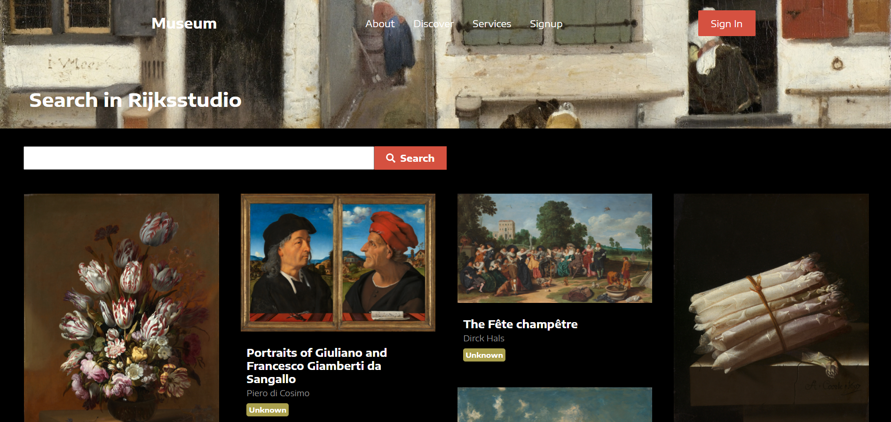

# Museum


```
React.js와 RIJKS 박물관의 오픈API를 이용하여 작품들을 검색 및 감상할 수 있게 개발한 미술박물관 사이트입니다.
Pinterest의 masonry Layout에서 영감을 받아 그림이 차곡차곡 쌓는 형태의 레이아웃으로 CSS를 구현하였고 Infinite Scrolling을
적용하여 데이터를 계속해서 불러올 수 있도록 구현하였습니다. 또한 성능최적화를 위해 LazyImageLoading 라이브러리를적용하였습니다.
```

--------------------------------------------
#### 완성된 페이지
  
--------------------------------------------

### 사용한 기술
```
- React.js
- React-Router
- Styled-components
- Lazy-Imgage-Loading
- Webpack
- Axios
```

### portfolio site
https://ljh9506.github.io/museum/
